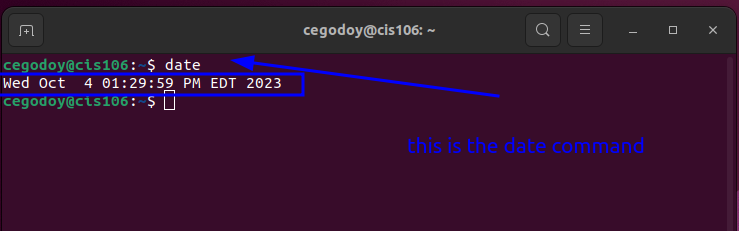
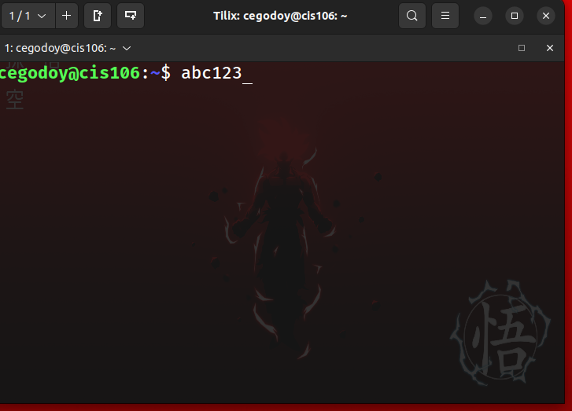
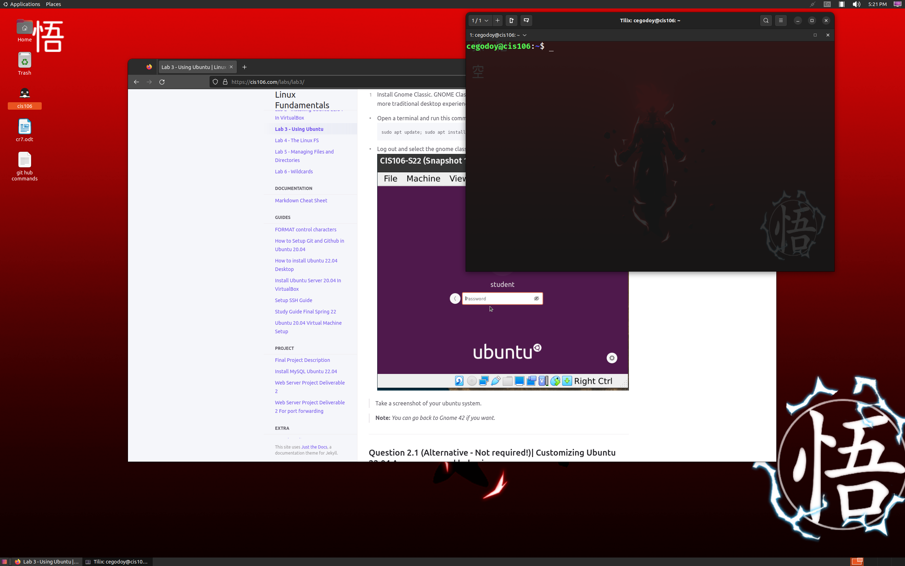

# Lab 3

## Question 1

### Question 2

#### Question 3

| Program purpose     | Package Name        | Version             |
| ------------------- | ------------------- | ------------------- |
| Play a tetris game  |  blockattack        | 2.7.0-1             |
| Play a video file   |  dragonplayer       | 4:21.12.3-0ubuntu1  |
| Browse the internet |  ephiphany-browser  | 42.4-0ubuntu1       |
| Read your email     |  aerc               | 0.8.2-1ubuntu0.2    |
| Play music          |  lxmusic player     | 0.4.7-1.1           |

##### Question 4

| command | what it does |
| ------- | ------------ |
| echo    | Displays a line of text                                                                                        |
| fortune | prints out a random epigram                                                                                    |
| cowsay  | generates an ASCII picture of a cow saying something provided by the user                                      |
| lolcat  |is a program that concatenates files, or standard input, to standard output, and adds a rainbow coloring to it  |
| figlet  | prints  its  input  using large characters                                                                     |
| toilet  | prints  text using large characters made of smaller characters                                                 |
| rig     | is  a  utility  that will piece together a random personal information                                         |